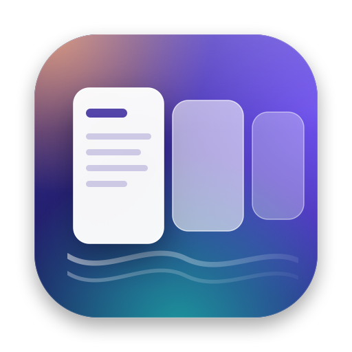

<p align="center"></p>

<h1 align="center">Wake</h1>

<p align="center">A macOS browser where pages are columns in a trail, not tabs in a bar.</p>

Wake is a native macOS browser built with SwiftUI, AppKit and WebKit. No Chromium, no Electron.

## What's in it

- **The trail.** Links open as columns to the right, Niri-style. One column fills the window, two share it, more scroll. Each column resizes on its own edges without squeezing its neighbours.
- **Threads and the Deck.** Each window works on a thread of pages. ⌘K raises the Deck: every thread as a live card that floats by how recently you used it and sinks when you don't. Cards show one live chip each (a failing CI run, a price drop, media time, unread count, an HTTP error).
- **Moments.** ⌘D saves where you were on a page: scroll position, your selection and why you saved it. Opening a moment scrolls back and re-highlights. Moments resurface by date or when you're on their site. Wake checks saved pages in the background and tells you what changed. Moments you never open fade and archive themselves.
- **Pop Out.** Pick any part of a page and float it, live, in its own small always-on-top panel.
- **Apps.** Pin web apps to a slim capsule with unread badges.
- **Developer mode.** Turns on automatically for localhost: local dev servers found on common ports, a DevTools column (console, network with replay, cURL and mocks), open-in-editor through source maps, device previews at real iPhone and iPad sizes, a component inspector, a JSON viewer, git branch and HMR status.
- **Zen, glass and settings.** Chrome floats as Liquid Glass islands on macOS 26 and appears only when you need it.

## Building

Requirements: macOS 14 or later, Xcode 16 or later, [XcodeGen](https://github.com/yonaskolb/XcodeGen).

```bash
xcodegen generate
xcodebuild -project Wake.xcodeproj -scheme Wake -configuration Debug -derivedDataPath build/DerivedData build
open build/DerivedData/Build/Products/Debug/Wake.app
```

The Xcode project is generated from `project.yml` and isn't checked in.

The app icon is drawn in code; to regenerate it, run `swift Scripts/make-icon.swift`.

## Layout

One feature per folder under `Wake/Features` (Trail, Deck, Threads, Moments, PopOut, Live, Developer, Apps, Settings, …), with app wiring in `Wake/App` and shared helpers in `Wake/Support`. `HANDOFF.md` describes the architecture in more detail.
